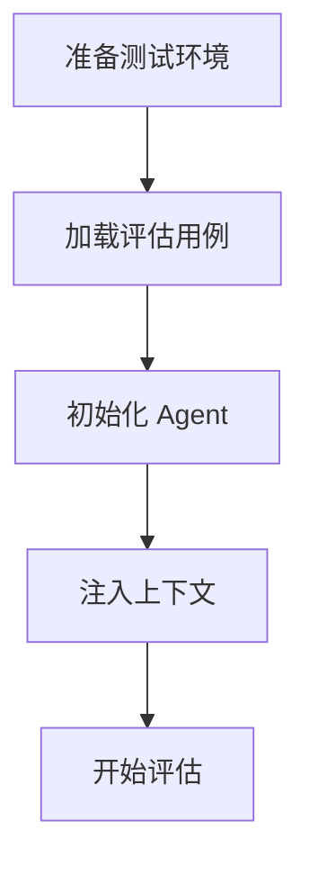
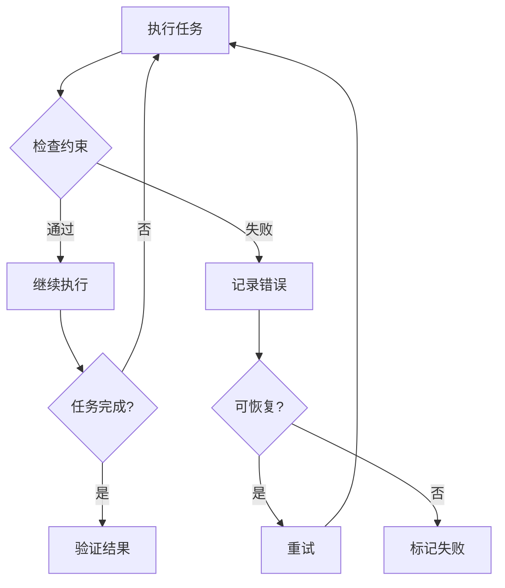
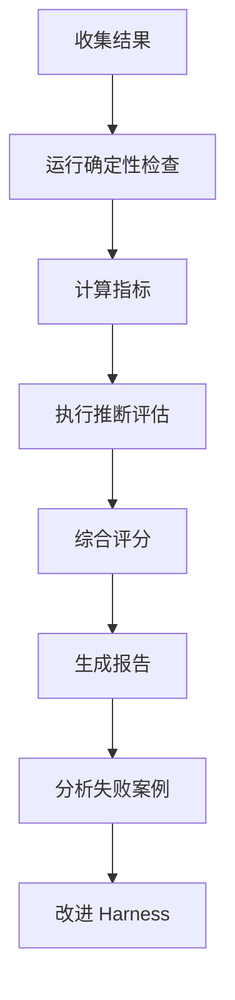

# 评估体系

本文档定义 AI Agent 的评估方法和指标体系。

## 核心理念

**将 Agent 轨迹转化为可重复的评估。**

使用有界任务、无技能基线和轨迹评分来评估长期多步骤任务。

## 评估类型

### 1. 确定性检查 (Deterministic Checks)

```
┌─────────────────────────────────────────────────────────────┐
│                   确 定 性 检 查                             │
├─────────────────────────────────────────────────────────────┤
│                                                             │
│   输入 ──▶ 预期输出 ──▶ 实际输出 ──▶ 比较 ──▶ 通过/失败       │
│                                                             │
│   ✓ 编译通过                                                │
│   ✓ 测试通过                                                │
│   ✓ Lint 通过                                               │
│   ✓ 类型检查通过                                            │
│   ✓ 文件存在                                                │
│   ✓ 输出格式正确                                             │
│                                                             │
└─────────────────────────────────────────────────────────────┘
```

**特点**: 结果明确，无歧义

### 2. 推断型评估 (Inferential Evaluation)

```
┌─────────────────────────────────────────────────────────────┐
│                   推 断 型 评 估                             │
├─────────────────────────────────────────────────────────────┤
│                                                             │
│   评估标准 ──▶ Agent 输出 ──▶ 评分器 ──▶ 分数                │
│                                                             │
│   评分维度:                                                  │
│   ├── 代码质量 (可读性、可维护性)                            │
│   ├── 架构合理性                                            │
│   ├── 边界情况处理                                           │
│   └── 文档完整性                                             │
│                                                             │
└─────────────────────────────────────────────────────────────┘
```

**特点**: 需要语义理解，可能有主观性

### 3. 分层验证 (Layered Verification)

```
┌─────────────────────────────────────────────────────────────┐
│                   分 层 验 证 体 系                           │
├─────────────────────────────────────────────────────────────┤
│                                                             │
│   L5: 端到端评估 ──▶ 真实场景集成测试                         │
│            │                                                │
│   L4: 语义评估 ──▶ AI 评分器 + 人工审核                        │
│            │                                                │
│   L3: 质量评估 ──▶ 覆盖率、复杂度、可维护性                   │
│            │                                                │
│   L2: 功能评估 ──▶ 单元测试、集成测试                         │
│            │                                                │
│   L1: 语法评估 ──▶ 编译、类型检查、Lint                       │
│                                                             │
└─────────────────────────────────────────────────────────────┘
```

## 评估指标

### 1. 任务完成度

| 指标 | 描述 | 计算方式 |
|------|------|----------|
| 任务成功率 | 成功完成任务的比例 | 成功数 / 总任务数 |
| 部分完成率 | 部分完成任务的比例 | 部分完成 / 总任务数 |
| 平均进度 | 任务完成的平均程度 | 各阶段完成度之和 / 任务数 |

### 2. 效率指标

| 指标 | 描述 | 理想值 |
|------|------|--------|
| Token 效率 | 完成任务的 Token 消耗 | 越低越好 |
| 时间效率 | 完成任务的平均时间 | 越低越好 |
| 步骤数 | 完成任务所需的平均步数 | 越低越好 |
| 重试率 | 需要重试的比例 | 越低越好 |

### 3. 质量指标

| 指标 | 描述 | 阈值 |
|------|------|------|
| 测试覆盖率 | 新代码的测试覆盖率 | ≥ 80% |
| Lint 通过率 | 代码风格合规率 | 100% |
| 类型完整率 | 类型定义完整率 | ≥ 95% |
| 文档覆盖率 | 代码文档化程度 | ≥ 70% |

### 4. 安全性指标

| 指标 | 描述 | 阈值 |
|------|------|------|
| 漏洞数 | 发现的安全漏洞数 | 0 |
| 敏感信息泄露 | 泄露的敏感信息 | 0 |
| 越权操作 | 未授权的操作数 | 0 |

## 评估框架

### SWE-bench 模式

```yaml
# evals/swe-bench-style.yaml
evaluation:
  name: "Code Modification Task"
  type: "end_to_end"

  task:
    description: "修复指定的 bug 或实现功能"
    setup:
      - clone_repository
      - install_dependencies
      - prepare_test_environment

    execution:
      max_steps: 20
      timeout: 600

    verification:
      - run_test_suite
      - check_artifact_presence

  scoring:
    pass: "所有测试通过"
    partial: "部分测试通过"
    fail: "测试失败或超时"
```

### 轨迹评分器

```yaml
# evals/trajectory-evaluator.yaml
trajectory_evaluator:
  name: "Multi-step Task Evaluator"

  dimensions:
    - name: "planning"
      weight: 0.2
      criteria:
        - "任务分解合理性"
        - "步骤排序正确性"
        - "资源评估准确性"

    - name: "execution"
      weight: 0.3
      criteria:
        - "命令执行正确性"
        - "错误恢复能力"
        - "工具使用效率"

    - name: "verification"
      weight: 0.3
      criteria:
        - "结果验证完整性"
        - "测试覆盖充分性"
        - "质量检查严格性"

    - name: "communication"
      weight: 0.2
      criteria:
        - "状态报告清晰度"
        - "问题描述准确性"
        - "进度反馈及时性"
```

### Benchmark 套件

```yaml
# evals/benchmarks.yaml
benchmarks:
  coding:
    - name: "SWE-bench Verified"
      description: "真实 GitHub Issue 修复"
      metric: "issue_resolved"

    - name: "Terminal-Bench"
      description: "终端任务执行"
      metric: "task_completion"

    - name: "LeetCode Hard"
      description: "算法问题求解"
      metric: "problem_solved"

  web:
    - name: "WebArena"
      description: "Web 任务自动化"
      metric: "task_completion"

    - name: "VisualWebArena"
      description: "视觉网页任务"
      metric: "task_completion"

  tool_use:
    - name: "MCP Bench"
      description: "MCP 工具使用"
      metric: "tool_usage_accuracy"
```

## 评估流程

### 1. 评估准备



### 2. 执行评估



### 3. 结果评估



## 评估配置

```yaml
# evals/config.yaml
evaluation:
  environment:
    container: "sandboxed"
    isolation: "full"
    network: "restricted"

  agent:
    model: "gpt-4o"
    temperature: 0.2
    max_tokens: 4096
    tools:
      enabled: ["read", "write", "bash", "search"]
      restricted_paths: ["/etc", "/root"]

  metrics:
    collection:
      - traces
      - tool_calls
      - errors
      - timing

    aggregation:
      - mean
      - median
      - p95
      - pass_rate

  reporting:
    formats: ["json", "html", "markdown"]
    storage: "evals/results/"
    dashboard: true
```

## 常见基准

| 基准 | 领域 | 特点 |
|------|------|------|
| SWE-bench | 软件工程 | 真实 Issue 修复 |
| AgentBench | 多领域 | 综合评估 |
| Terminal-Bench | CLI 任务 | 终端操作 |
| WebArena | Web 自动化 | 浏览器任务 |
| GAIA | 通用 AI | 开放问题 |

## 改进循环

```
┌─────────────────────────────────────────────────────────────┐
│                   持 续 改 进 循 环                           │
├─────────────────────────────────────────────────────────────┤
│                                                             │
│   ┌──────────┐    ┌──────────┐    ┌──────────┐             │
│   │  评估     │───▶│  分析     │───▶│  改进     │             │
│   └──────────┘    └──────────┘    └──────────┘             │
│        │                │                │                │
│        │                │                │                │
│        └────────────────┴────────────────┘                │
│                                                             │
│   评估: 运行测试、收集指标                                    │
│   分析: 识别问题、定位根因                                    │
│   改进: 调整 Harness、更新规范                                │
│                                                             │
└─────────────────────────────────────────────────────────────┘
```

## 相关文档

- [HARNESS.md](../HARNESS.md) - 总体规范
- [AGENTS.md](../AGENTS.md) - Agent 配置
- [observability.md](./observability.md) - 可观测性
- [best-practices.md](./best-practices.md) - 最佳实践
- [evals/README.md](../evals/README.md) - 评估指南
